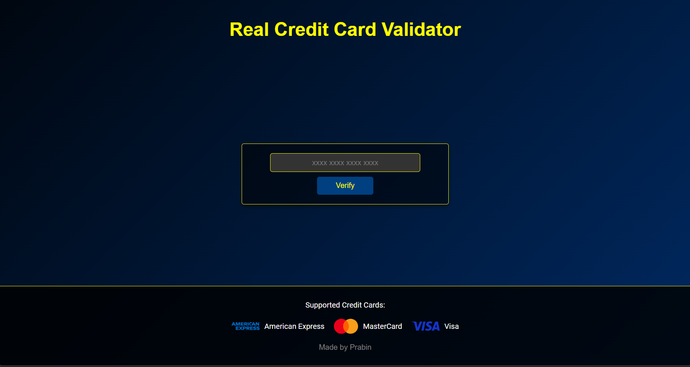

# 🚀 **Credit Card Validator**

Welcome to the **Credit Card Validator** - a sleek and interactive web application designed to validate and identify credit card numbers with style! This project leverages modern web technologies to deliver a visually stunning user experience.

 <!-- Replace with actual image -->

## 🌟 **Features**

- **🔍 Real-Time Validation**: Utilizes Luhn’s Algorithm to verify the validity of credit card numbers.
- **💳 Card Type Detection**: Identifies and displays card types (American Express, MasterCard, Visa) with elegant logos.
- **🎨 Stylish Design**: Experience a dynamic gradient background with navy blue and black hues for a modern look.
- **📱 Responsive Layout**: Optimized for seamless use across all devices, from mobile phones to desktops.
- **🖥️ User-Friendly Interface**: Simple, intuitive design ensures easy navigation and quick results.

## ⚙️ **How It Works**

### 🔢 **Luhn’s Algorithm**

Luhn’s Algorithm is a checksum formula that validates credit card numbers. Here’s a brief overview of its operation:

1. **Double Every Second Digit**:
   - Starting from the right, double every second digit. If doubling results in a number greater than 9, add the digits of the result.

2. **Sum All Digits**:
   - Add all the digits together.

3. **Validation Check**:
   - If the total modulo 10 equals zero, the card number is valid.

### 💡 **Card Type Detection**

- **American Express**: Starts with 34 or 37, 15 digits.
- **MasterCard**: Starts with 51 to 55, 16 digits.
- **Visa**: Starts with 4, 13 or 16 digits.

## 🛠️ **Usage**

1. **Enter Credit Card Number**:
   - Type your credit card number in the input field. The field supports the format `1234 5678 9012 3456` `16 digit` number.

2. **Click "Verify"**:
   - Press the "Verify" button to check the card’s validity. The results will show the card type and logo if valid.

3. **View Results**:
   - Valid cards will display the card type and logo. Invalid cards will prompt a notification.

## 🚀 **Getting Started**

To get this project up and running locally:

1. **Clone the Repository**:
   ```bash
   git clone https://github.com/yourusername/credit-card-validator.git
